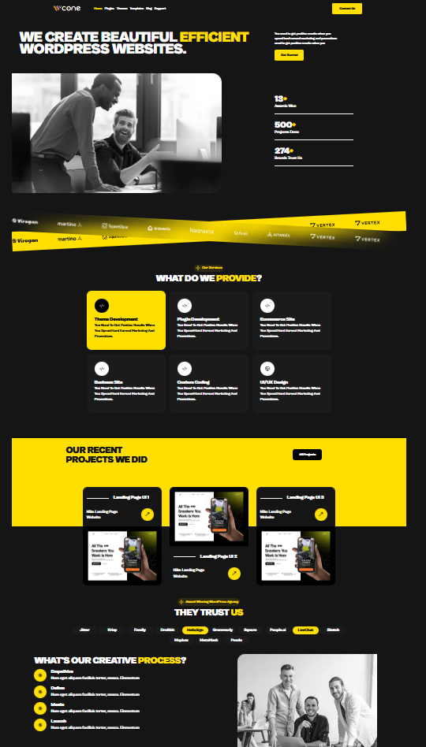

# Cone App 🚀

**Cone App** is the sleek, modern frontend for a company focused on full-stack application development. It’s designed as a single, polished landing page with smooth animations and a responsive layout.

---

## 🌟 Features

- Fully responsive landing page
- Smooth animations using **framer-motion**
- Crisp, customizable icons with **lucide-react**
- Clean and modern design using **TailwindCSS**
- Built with **TypeScript** and **Next.js** for scalability

---

## 🛠 Tech Stack

- [TypeScript](https://www.typescriptlang.org/)
- [Next.js](https://nextjs.org/)
- [TailwindCSS](https://tailwindcss.com/)
- [framer-motion](https://www.framer.com/motion/)
- [lucide-react](https://lucide.dev/)

---

## 👀 Preview



---

## 🚀 Getting Started

1. Clone the repository:

```bash
git clone <repo-url>
```

2. Navigate to the project folder:

```bash
cd cone-app
```

3. Install dependencies:

```bash
npm install
```

4. Run the development server:

```bash
npm run dev
```
